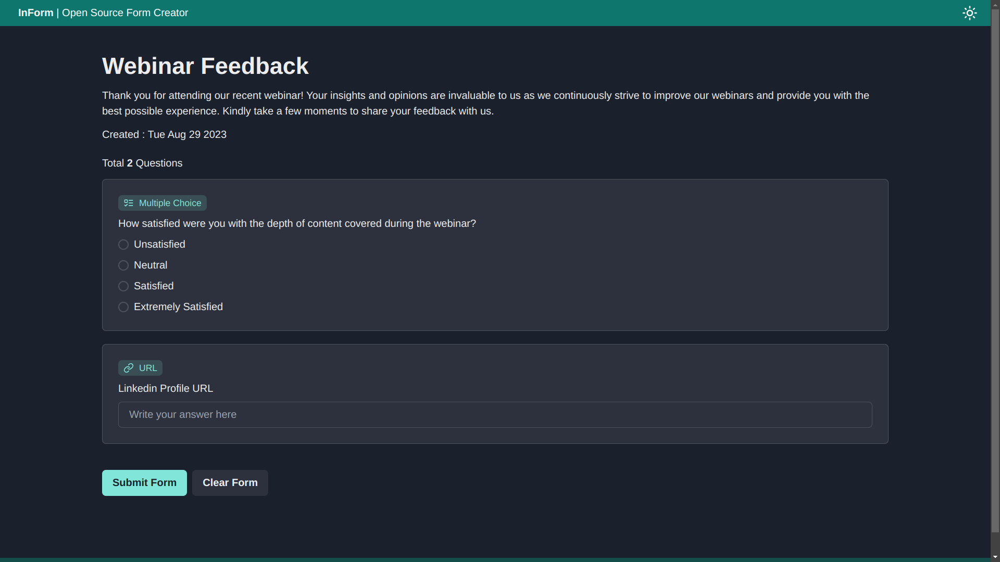
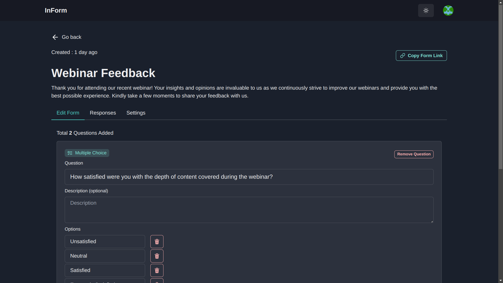
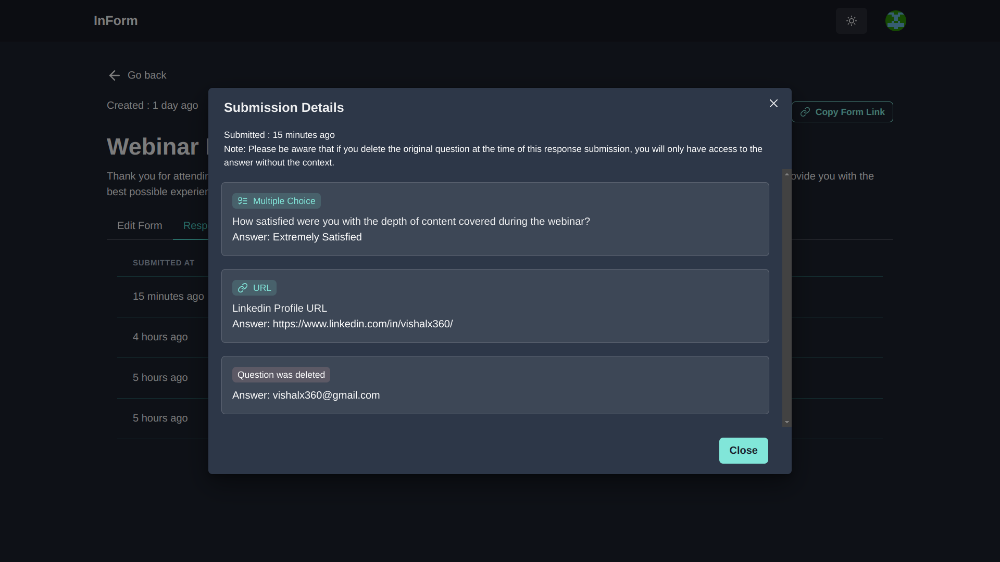
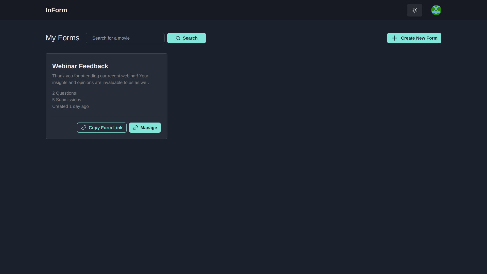
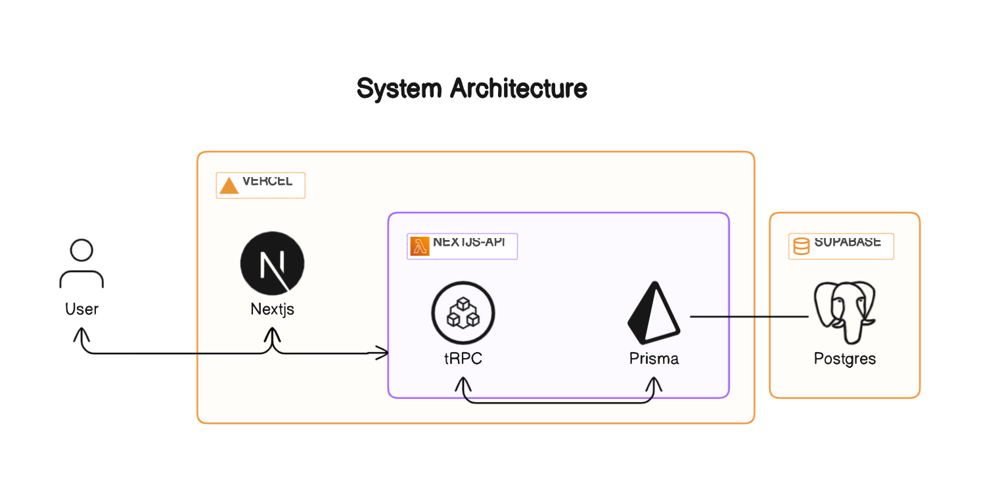
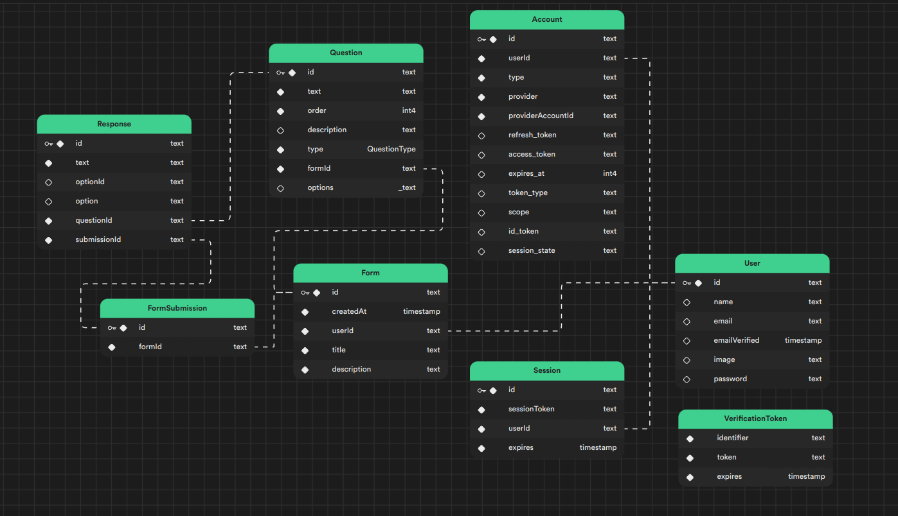

## Building a Google Forms Clone: InForm

## 

## Introduction

- A web application resembling Google Forms, facilitating form creation, sharing, and response visualization.
- Utilized React.js and Node.js for frontend and backend development.

---

## Project Overview

- **Objective:** Develop a web app similar to Google Forms.
- Users can create forms, share them, and visualize responses.
- Tech Stack: React.js, Node.js, Next.js, Chakra UI, Supabase, GitHub Actions.

---

## Demo / Screenshots

Check out the live demo: [https://inform-app.vercel.app](https://inform-app.vercel.app)

|                    Form Fill Up Page                     |                    Form Editor Page                    |
| :------------------------------------------------------: | :----------------------------------------------------: |
|  |  |

|                    Form Submissions Page                    |                   Dashboard Page                   |
| :---------------------------------------------------------: | :------------------------------------------------: |
|  |  |

<!-- Include screenshots and GIFs for live demo -->
<!-- Make sure to visually present form creation, sharing, response visualization, and optional features -->

---

## Features Overview

1. **Form Creation:** Create tailored forms after authentication.
2. **Seamless Sharing:** Share forms via unique links.
3. **Form Completion:** Users can complete forms.
4. **Response Visualization:** Form owners can visualize responses.

---

## Optional Features

1. Media Submission: Allow users to submit images, URLs, files.
2. Email Sharing: Form owners can share forms via emails.
3. Admin Dashboard: Dashboard to manage forms efficiently.

---

## Tech Stack

- **Frontend:** Next.js, Chakra UI, Tailwind CSS.
- **Backend:** Node.js, Next.js serverless functions.
- **Database:** Supabase Serverless Postgres DB.
- **Authentication:** Nextauth for secure authentication.
- **CI/CD:** GitHub Actions for automated testing and deployment.

---

## System Architecture

- Showcases how frontend, backend, and database components interact.
- Ensures seamless user experience and efficient data flow.

---

## Database Schema

- Illustrates data structure and relationships in Supabase Serverless Postgres DB.
- Supports core functionalities of the application.

---

## CI/CD Pipeline

- GitHub Actions automates CI/CD process.
- Ensures code quality, testing, and reliable deployment.

---

## Challenges Faced

- Overcame technical hurdles during development.
- Challenges fueled learning and growth.
- Adapted strategies to ensure project success.

---

## Conclusion

- InForm addresses Mercor's Fullstack Coding Challenge.
- Embraces form creation, sharing, and response visualization.
- Leveraged cutting-edge technologies for seamless user experience.

---

## Questions & Discussion

- Open to questions from the interview panel.
- Ready to discuss design decisions, challenges, and technical aspects.

---

## Thank You!

- Grateful for the opportunity to showcase InForm.
- Looking forward to discussing the project further.
