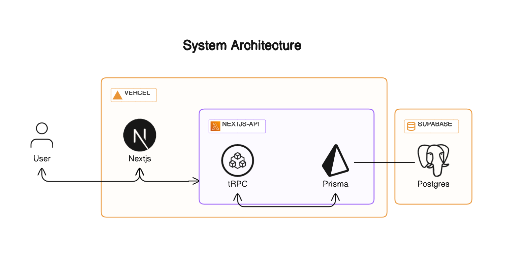

# InForm

**Solution for Full Stack Developer Assignment | [mercor](https://mercor.io)**

InForm is a web application that empowers users to create forms, share them, and gather survey responses effectively.

## Demo

Check out the live demo: [https://inform-app.vercel.app](https://inform-app.vercel.app)

## Features

### Form Creation Flexibility

Empower users to craft tailored forms effortlessly, adapting to their unique requirements.

### Seamless Sharing Capability

Enable users to effortlessly share form links with a wide audience, fostering collaboration and data gathering.

### Submission Tracking and Review

Provide users with the means to conveniently access and assess submitted form responses, streamlining data analysis.

### Dynamic Post-Creation Editing

Offer the flexibility to fine-tune forms even after their initial creation, ensuring the ongoing relevance and effectiveness of each form.

### Versatile Question Types with Precision Validation

Equip users with a range of question types, each fortified with meticulous validation:

- Multiple Choice Queries
- Text Inquiries
- Email Address Queries
- URL Input Queries

## Screenshots

|                    Form Fill Up Page                     |                    Form Editor Page                    |
| :------------------------------------------------------: | :----------------------------------------------------: |
|  |  |

|                    Form Submissions Page                    |                   Dashboard Page                   |
| :---------------------------------------------------------: | :------------------------------------------------: |
|  |  |

## Tech Stack

### Highlights

1. **Front-End with Next.js:** Utilized Next.js, a versatile front-end framework, for creating an interactive and seamless user interface, enhancing rendering efficiency and user experience.

2. **Backend with Next.js Serverless Functions:** Employed Next.js serverless functions to construct a robust and agile backend, handling API requests, data retrieval, and database interactions with precision.

3. **Database and Data Storage:** Utilized Supabase Serverless Postgres DB for database architecture, ensuring data integrity and optimal storage solutions.

4. **CI/CD Pipelines:** Implemented Continuous Integration/Continuous Deployment (CI/CD) through GitHub Actions, ensuring a reliable and efficient codebase.

### Technology Stack

- [Next.js](https://nextjs.org): A React framework for building web applications.
- [tRPC](https://trpc.io/): A fast TypeScript RPC framework for building APIs.
- [Supabase DB](https://supabas.com): A serverless Postgres database for storing and retrieving data.
- [Prisma](https://www.prisma.io): A type-safe ORM for TypeScript and Node.js.
- [Nextauth](https://next-auth.js.org): An open source authentication solution for Next.js applications.
- [Tailwindcss](https://tailwindcss.com/): A utility-first CSS framework for building custom designs.
- [Chakra-UI](https://chakra-ui.com/): A modern component library for React.
- [Vercel](https://vercel.com): A cloud platform for deploying and managing web applications.
- [GitHub Actions](https://github.com/features/actions): A CI/CD platform automating build, test, and deployment pipelines.

## System Architecture (HLD)

## Database Schema

## CI/CD Pipeline

