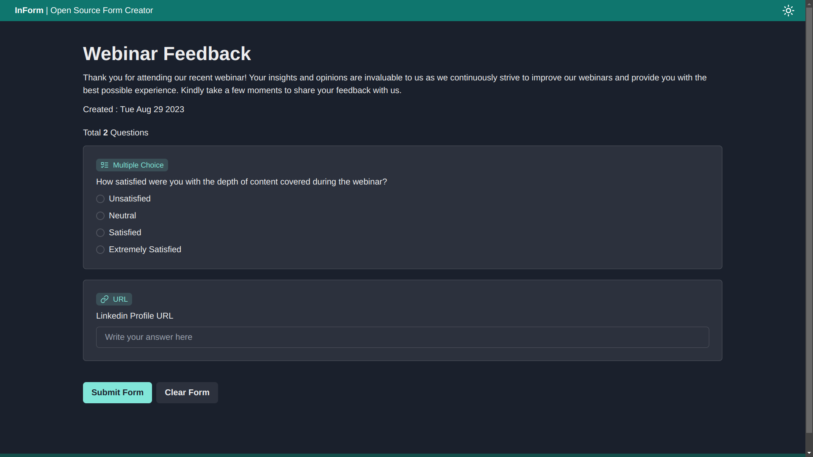
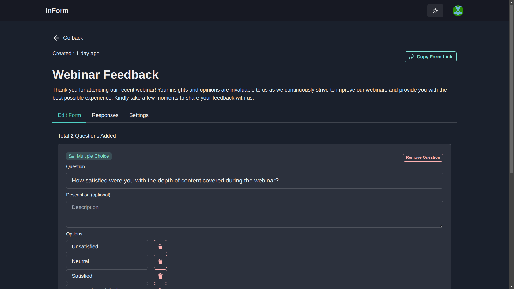
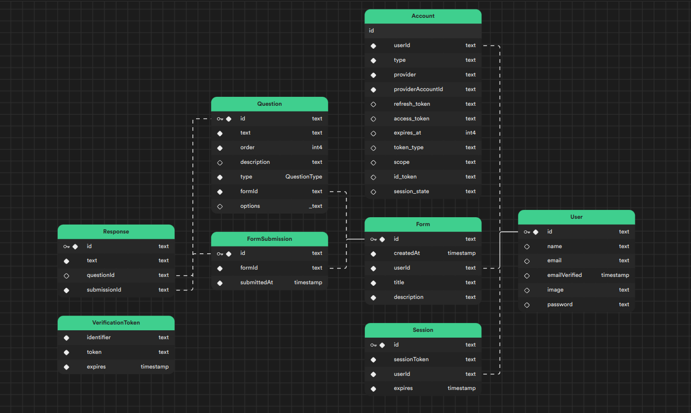

# InForm

Demo: [https://inform-app.vercel.app](https://inform-app.vercel.app)

Solution for Full Stack Developer Assignment | Mercor

A web application that allows users to create forms and take surveys.

## Getting Started

Want to setup locally ? follow [Setup Instructions](/Setup-Instruction.md)

## Application Features

1. **Form Creation Flexibility:**
   Empower users to craft tailored forms effortlessly, adapting to their unique requirements.

2. **Seamless Sharing Capability:**
   Enable users to effortlessly share form links with a wide audience, fostering collaboration and data gathering.

3. **Submission Tracking and Review:**
   Provide users with the means to conveniently access and assess submitted form responses, streamlining data analysis.

4. **Dynamic Post-Creation Editing:**
   Offer the flexibility to fine-tune forms even after their initial creation, ensuring the ongoing relevance and effectiveness of each form.

5. **Versatile Question Types with Precision Validation:**
   Equip users with a range of question types, each fortified with meticulous validation:

   - **Multiple Choice Queries:**
     Users can incorporate multiple choice questions, presenting respondents with pre-defined options. In-built validation guarantees accurate and insightful answers.

   - **Freeform Text Inquiries:**
     Text-based questions allow respondents to provide open-ended responses. Validation options, like character constraints or mandatory fields, uphold data integrity.

   - **Email Address Queries:**
     Integrate email-related questions to capture valid email entries. Validation protocols assure the correctness of submitted email addresses.

   - **URL Input Queries:**
     Users can introduce questions requiring URLs, permitting respondents to provide web addresses. Validation protocols ensure well-formed URL submissions.

## Screenshots

|                Form Fill Up Page                 |               Form Editor Page                |
| :----------------------------------------------: | :-------------------------------------------: |
|  |  |

|              Form Submissions Page              |               Dashboard Page                |
| :---------------------------------------------: | :-----------------------------------------: |
|  |  |

## Tech Stack

### Highlights:

1. Front-End with Next.js: Next.js, a versatile front-end framework, was utilized to create an interactive and seamless user interface. This choice facilitated efficient rendering and enhanced user experience.

2. Backend with Next.js Serverless Functions: I employed Next.js serverless functions to construct a robust and agile backend. This approach allowed me to handle API requests, data retrieval, and database interactions with precision.

3. Database and Data Storage: The database architecture is based on Supabase Serverless Postgres DB, ensuring data integrity and optimal storage solutions.

4. CI/CD Pipelines: Continuous Integration/Continuous Deployment (CI/CD) is facilitated through GitHub Actions, guaranteeing a reliable and efficient codebase.

| Technology                                            | Description                                                                                                                                 |
| ----------------------------------------------------- | ------------------------------------------------------------------------------------------------------------------------------------------- |
| [Next.js](https://nextjs.org)                         | A React framework for building web applications.                                                                                            |
| [tRPC](https://trpc.io/)                              | A fast TypeScript RPC framework for building APIs.                                                                                          |
| [Supabase DB](https://supabas.com)                    | A serverless Postgres database for storing and retrieving data.                                                                             |
| [Prisma](https://www.prisma.io)                       | A type-safe ORM for TypeScript and Node.js.                                                                                                 |
| [Nextauth](https://next-auth.js.org)                  | An open source authentication solution for Next.js applications.                                                                            |
| [Tailwindcss](https://tailwindcss.com/)               | A utility-first CSS framework for building custom designs.                                                                                  |
| [Vercel](https://vercel.com)                          | A cloud platform for deploying and managing web applications.                                                                               |
| [Github Actions](https://github.com/features/actions) | A continuous integration and continuous delivery **(CI/CD)** platform that allows you to automate your build, test, and deployment pipeline |

## System Arch (HLD)

## Database Schema

## CI/CD Pipeline

